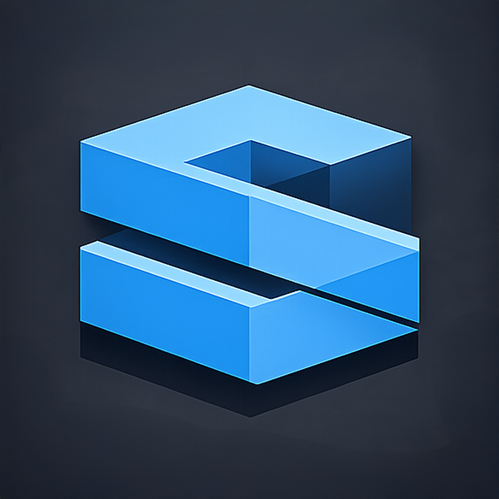

<p align="center">
  
</p>

<h1 align="center">S3UI</h1>

<p align="center">
A native desktop file manager for Amazon S3 and S3-compatible services.
</p>

<p align="center">
  <a href="https://pypi.org/project/s3ui/"></a>
  <a href="https://pypi.org/project/s3ui/"></a>
  <a href="LICENSE"></a>
</p>

---

S3UI is a free, open-source, cross-platform desktop app that makes Amazon S3 feel like a local file system. It provides a dual-pane file manager — local files on the left, S3 on the right — with drag-and-drop transfers, large-file handling, and built-in cost tracking.

Works with **Amazon S3**, **MinIO**, and any S3-compatible storage.

## Features

- **Dual-pane browser** — local filesystem and S3 side by side
- **Drag and drop** — drop files onto the S3 pane to upload
- **Upload and download** — right-click context menus or drag and drop
- **New folder** — toolbar button and context menu
- **Multipart uploads** — large files are split and uploaded in parallel
- **Resume support** — interrupted transfers pick up where they left off
- **Transfer queue** — pause, resume, cancel, and retry individual transfers
- **Cost tracking** — estimates your monthly S3 costs as you work
- **AWS CLI profiles** — auto-discovers profiles from `~/.aws/config`
- **Custom endpoints** — connect to MinIO, LocalStack, or any S3-compatible service
- **Secure credentials** — stored in your OS keychain via `keyring`
- **Setup wizard** — guided first-run configuration
- **Keyboard shortcuts** — Ctrl+1/2 to switch panes, Ctrl+R to refresh, Ctrl+F to filter
- **System notifications** — notifies on large transfer completion when the app is in the background

## Install

```
pip install s3ui
```

Requires Python 3.11+ and a running display server (X11, Wayland, macOS, or Windows).

## Quick start

```
s3ui
```

On first launch, the setup wizard walks you through connecting your AWS account or S3-compatible service. You can also configure connections later from **Settings**.

### MinIO example

In the setup wizard or Settings > Credentials > Add Profile:

| Field | Value |
|---|---|
| Profile Name | `my-minio` |
| Access Key ID | `minioadmin` |
| Secret Access Key | `minioadmin` |
| Region | `us-east-1` |
| Endpoint URL | `http://localhost:9000` |

## Development

```bash
git clone https://github.com/justinGrosvenor/s3ui.git
cd s3ui
python -m venv .venv && source .venv/bin/activate
pip install -e ".[dev]"
pre-commit install
pytest
```

## License

[MIT](LICENSE)
